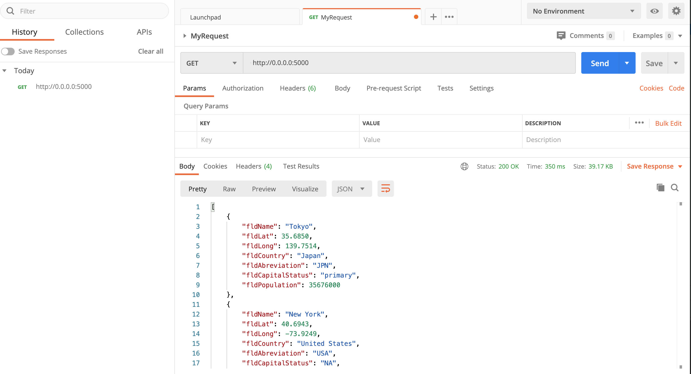
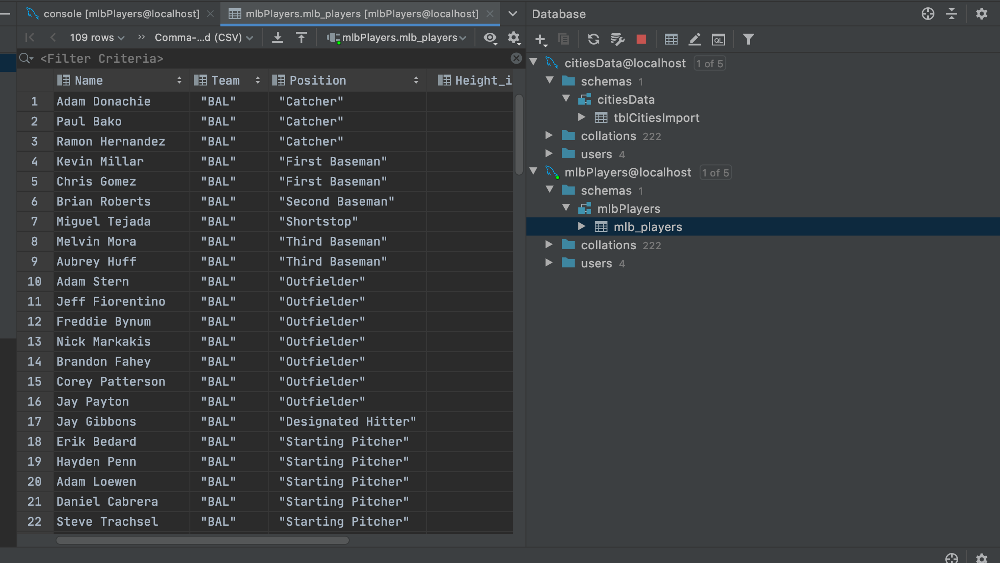
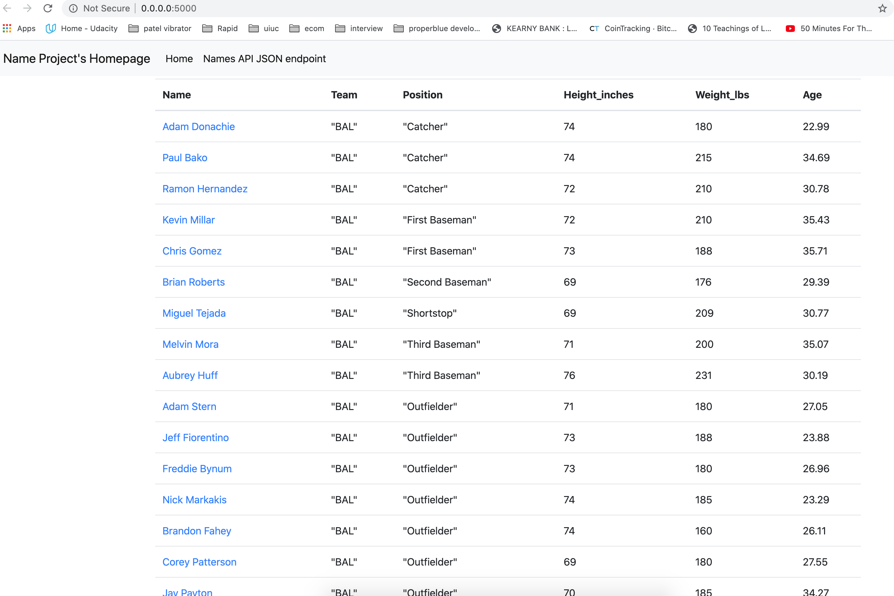
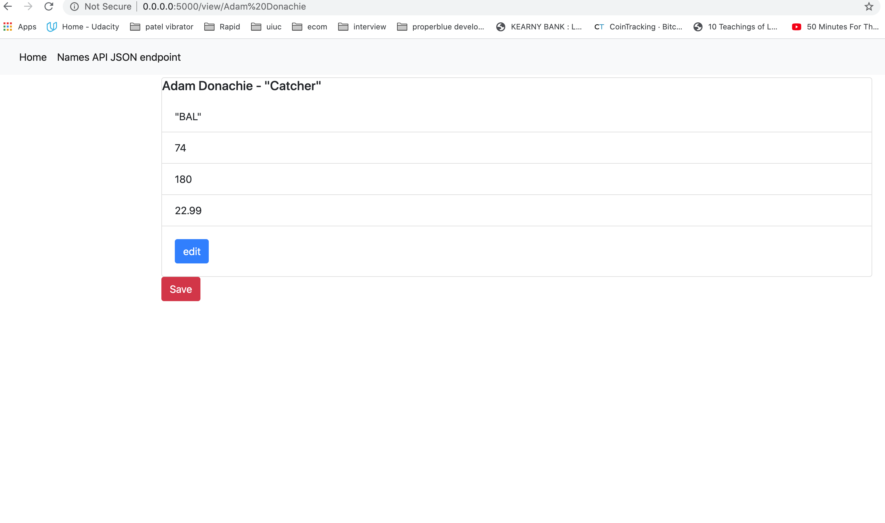
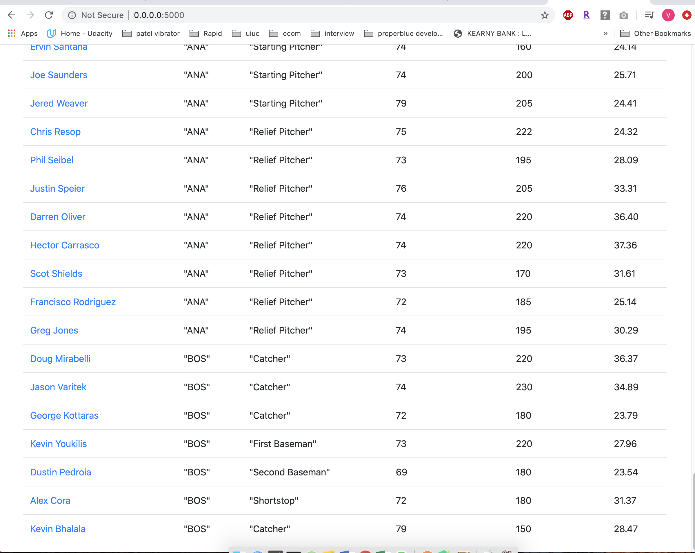
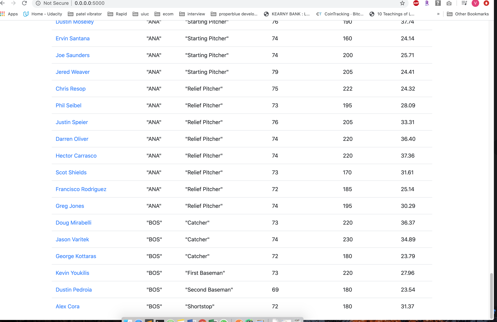
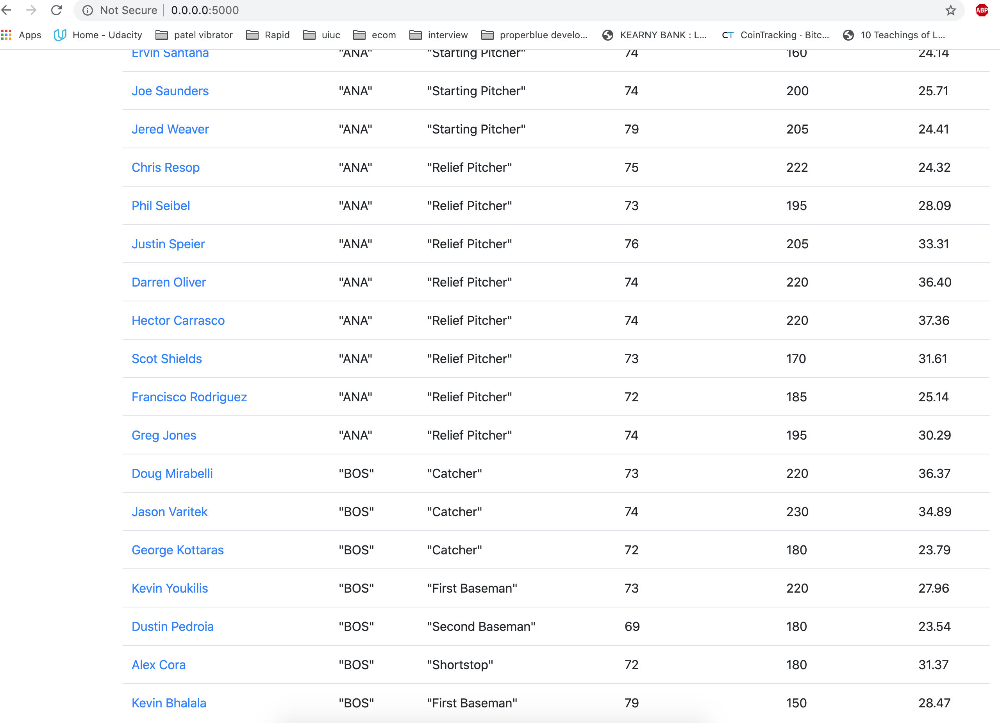

# Project Description
This project contains information about flask forms introduction.

# Postman Screenshot

# My data table in Pycharm

# My data homepage displaying in browser

# Viewing one record in browser

# Added new record

# Delete new record

# Edited the added record

